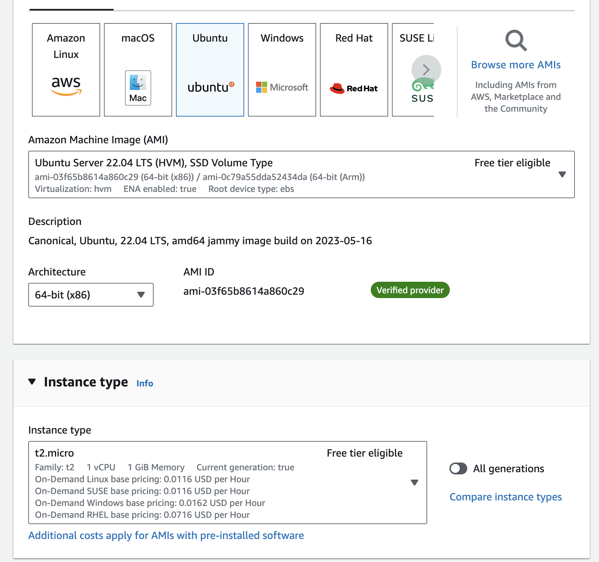
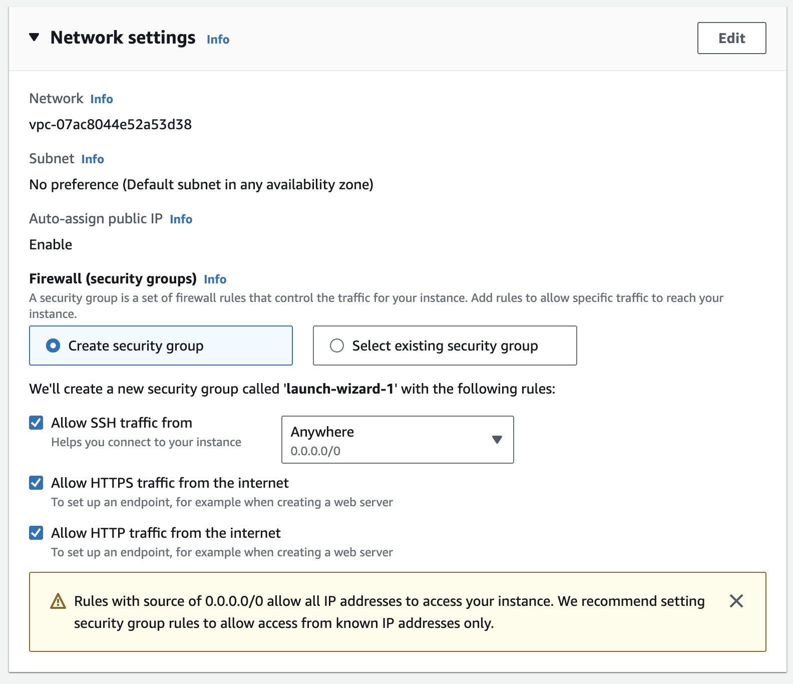
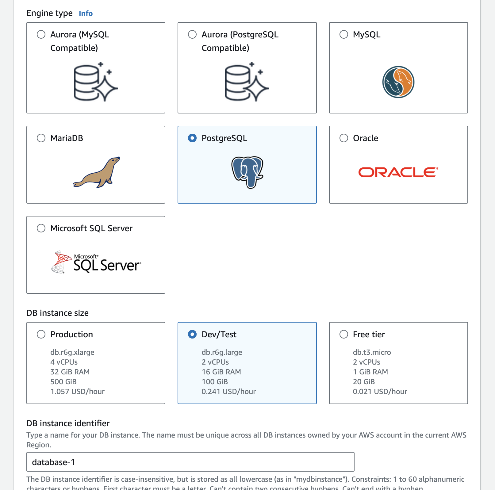
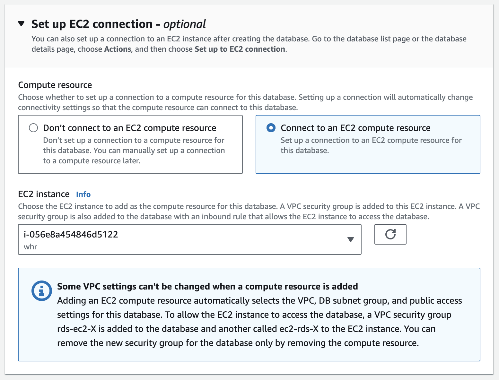

## Self-hosted Webhook Relay on AWS

Deploying Webhook Relay on AWS is easy and can be done in a few minutes. This guide will walk you through the process of deploying Webhook Relay on AWS.

## Prerequisites

Before you start, you will need to:

- Obtain the license key for self-hosted Webhook Relay Transponder server (send us an email on info@webhookrelay.com to get the trial license)
- AWS account

## EC2 instance

First, you will need to create an EC2 instance where you will run the self-hosted server. 

Go to the AWS console https://console.aws.amazon.com/ec2/home?region=us-west-2#LaunchInstances and select:
- Ubuntu OS
- Instance type t2.micro (or bigger)



- from the network settings select SSH, HTTP and HTTPS:



### Security group (when using tunnels)

For tunnels to work we will need to allow several more ports to connect to the EC2 instance:

- 9800 for the agent to establish a TCP
- 9801 for HTTP tunnels (user facing)
- 9802 for HTTPS tunnels (user facing)

## Database

Webhook Relay Transponder requires a PostgreSQL database. In this example we will create an AWS RDS Postgres instance:



and connect it:



from the additional settings make it create the initial database called `pgdb`, this will simplify things later.

## Installing the server

Once the EC2 instance is created, you can connect to it via SSH, such as:

```bash
ssh -i ~/.ssh/aws.pem ubuntu@YOUR_INSTANCE.us-west-2.compute.amazonaws.com
```

Then, let's install Docker and Docker Compose on Ubuntu:

```bash
sudo apt-get update
sudo apt-get install docker.io
sudo apt-get install docker-compose
```

Check whether Docker is working:

```bash
docker ps
```

Let's create a directory for the server:

```bash
mkdir -p /etc/webhookrelay
mkdir -p /etc/webhookrelay/data
mkdir -p /etc/webhookrelay/certs
cd /etc/webhookrelay
```

Download the database CRT bundle:

```
curl -o certs/global-bundle.pem https://truststore.pki.rds.amazonaws.com/global/global-bundle.pem
```

### Configure DNS

Webhook Relay is routing based on virtual hosts. We will need to configure DNS for your domain. 

For this, example I will create an A record pointing at the public IP address of my EC2 instance, to check I can just run:

```bash
host example-transponder.webhookrelay.com
example-transponder.webhookrelay.com has address 35.88.144.16
```


### Configuration file

Create an .env file with the following content:

```bash
ADMIN_USERNAME=admin
ADMIN_PASSWORD=change-me
ADMIN_API_KEY=cbcf9ee2-7fd2-4e2c-aa59-9c3fc441fdd4
ADMIN_API_SECRET=change-me

CA_URL=https://acme-staging-v02.api.letsencrypt.org/directory

HTTP_API_PORT=80
HTTPS_API_PORT=443

LICENSE=YOUR_LICENSE_KEY

MY_ADDRESS=127.0.0.1

LOGS_RETENTION_JOB_SCHEDULE="@midnight"
LOGS_RETENTION_DAYS=30

MANAGED_DOMAINS=example-transponder.webhookrelay.com

POSTGRES_HOST=database-1.cluster-YOUR_DB.us-west-2.rds.amazonaws.com
POSTGRES_USER=postgres
POSTGRES_PASSWORD=YOUR_PASSWORD
POSTGRES_DB=pgdb
POSTGRES_CA_CRT=/certs/global-bundle.pem
```

and copy the contents from the docker-compose.yaml file into the machine.

To start it, run:

```
docker-compose up -d
```

## Connecting the client

You will need to get the access key and token first. Go to the `https://your-self-hosted-whr/tokens` page and create a token.

It will show you a command similar to:

```
export RELAY_SECRET=CGyFGIBC67C8vUaH0
export RELAY_API_ADDRESS=https://example-transponder.webhookrelay.com
export RELAY_GRPC_API_ADDRESS=example-transponder.webhookrelay.com:9302
export RELAY_TUNNEL_API_ADDRESS=example-transponder.webhookrelay.com:443
```

once you export the variables, you can connect using the client and create tunnels, forward webhooks:

```bash
relay tunnel ls
```
